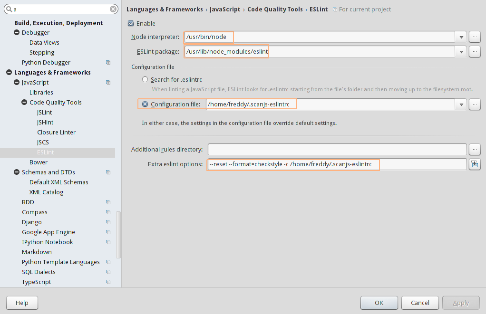

# ScanJS Rules through ESLint.

If you want to get something like ScanJS using ESLint. This is the config 
file.

## Install
```sh
npm -g install
* cp -v .eslintrc ~/.scanjs-eslintrc
```

<!--
Note that a globally installed eslint can see only globally installed plugins.

So you either have to install eslint itself and then required packages locally
Or everything globally.
-->


## Running
```sh
cd project-to-scan/
eslint --reset -c ~/.scanjs-eslintrc .
```

### Usage within IntelliJ IDEs (WebStorm, PyCharm etc.)
1. Open the Settings dialog and navigate to **Languages & Frameworks → JavaScript → Code Quality Tools → ESLint**.
2. **Enable it** and make sure your settings match your installation, especially:
3. Use a **globally installed eslint package**, the installer will place this in */usr/lib/node_modules/eslint* or */usr/local/lib/node_modules/eslint*
4. Reset the default rules, by providing **extra eslint options**, so we only use the provided scanjs-eslintrc. This disable the default eslint rules, which check for coding style, not security.


You can also check out this screenshot below.


